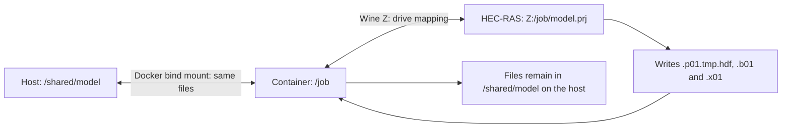
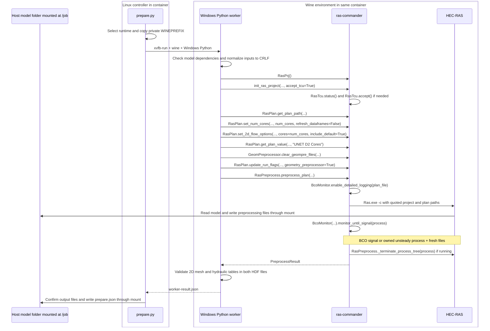

# What happens inside the HEC-RAS preprocessing container

[Installed code and GitHub source](INSTALLED-CODE.md) lists the packaged scripts,
links the controller source and exact installed library source.

Prepared for Andy's review. CLB Engineering Corporation, September 12, 2026.

The container provides Wine so [ras-commander][rc] can call installed Windows
HEC-RAS on Linux. It takes an existing model, prepares inputs for a separate
calculation stage, and leaves those files in the host's mounted working folder.

**Qualification status:** All three matching versions passed the full 266-hour Linux sample and the one-hour Windows Docker Desktop notebook, using two CPUs per container. Linux results contained 267 output times; Windows results contained two, with 6,548 finite water-surface values at every time. Live progress, resume and sequential batch checks passed on both hosts; the six Linux Wine LF/CRLF cases also passed. The images are published on Docker Hub, and anonymous pulls verified all six matching payloads.

The images include installed runtimes and saved TCU acceptance. The operating sequence is the same for each selected runtime. The path example below uses 6.5; other HEC-RAS versions use their matching installation directories.

The matching [native Linux image](https://github.com/gpt-cmdr/ras-commander/blob/codex/container-precompute-linux/containers/hecras-unsteady/README.md) completes the unsteady
calculation after preprocessing. The [Python operating guide](https://github.com/gpt-cmdr/ras-commander/blob/codex/container-precompute-linux/docs/user-guide/container-execution.md) and
[notebook](https://github.com/gpt-cmdr/ras-commander/blob/codex/container-precompute-linux/examples/512_docker_precompute_and_linux_compute.ipynb) show both stages through [ras-commander][rc].
See the [current release record](https://github.com/gpt-cmdr/ras-commander/blob/codex/container-precompute-linux/containers/hecras-unsteady/RELEASE-CURRENT.md) for full 266-hour Linux and one-hour Windows Docker Desktop qualification.

## Models created on Windows or Linux

Pull the matching current image before running. Use a disposable model copy and mount its referenced terrain and projection
folders. Relative paths are resolved inside the container: `..\source_terrain`
and `..\projection` must lead to mounted folders. Mounting a model folder alone
does not expose its siblings. The terrain HDF must also have access to its
referenced TIFF files.

Use `--user root` for the qualified Windows Docker Desktop route. The tests used a host folder containing spaces and read-only dependency mounts.

Before HEC-RAS starts, [model_checks.py][build-checks] reads the selected plan, geometry and
unsteady flow inputs, checks the existing 2D geometry HDF, and verifies the
projection, terrain HDF and referenced raster files. Missing dependencies fail
before any model file is modified.

The worker then normalizes the selected `.prj`, `.p##`, `.g##` and `.u##` text
files to Windows CRLF line endings, preserving all other bytes. LF, CRLF and
mixed inputs are accepted. This is necessary even though the container runs on
Linux: HEC-RAS is a Windows application under Wine. The generated `.x##` output
is still converted to Linux LF for the separate Linux calculation stage.

Before reporting success, the worker opens both the geometry HDF and temporary
plan HDF. They must retain the input's 2D area names and cell counts and contain
valid cell-volume and face-area elevation tables. Face counts may change when
HEC-RAS versions rebuild a mesh. The receipt records the normalized input names,
checked dependencies and HDF validation. A file's size, `File Type` attribute,
or presence of a `/Results` group is not proof of valid preprocessing.

The required starting model includes a populated geometry HDF, a `.rasmap`, a
projection file and a terrain HDF with its rasters. Qualification covers the
repository sample; it does not certify a complete hydraulic simulation.

## Wine, the HEC-RAS installation, and host data

[Wine](https://www.winehq.org/) supplies Windows application interfaces on Linux. It lets Windows Python
and the installed Windows HEC-RAS programs run inside this Linux container.
[ras-commander][rc] runs in Windows Python and calls HEC-RAS. HEC-RAS performs
the preprocessing; the container supplies the operating environment.

### Where HEC-RAS is installed

A Wine *prefix* is a directory holding a Windows-style C: drive, installed
programs, supporting DLLs, and Windows registry files. The image contains a
prepared prefix at `/runtime/wine-seed/prefix` and its settings in
`/runtime/wine-seed/runtime.json`.

| View | Installed executable path |
|---|---|
| Windows path seen by HEC-RAS and Python | `C:\Program Files (x86)\HEC\HEC-RAS\6.5\Ras.exe` |
| Linux path inside the image template | `/runtime/wine-seed/prefix/drive_c/Program Files (x86)/HEC/HEC-RAS/6.5/Ras.exe` |
| Linux path used by one running job | `/run/ras-job/<run-id>/wineprefix/drive_c/Program Files (x86)/HEC/HEC-RAS/6.5/Ras.exe` |

At startup the wrapper copies the prepared prefix into the job's private
scratch directory and sets `WINEPREFIX` to that copy. Wine can update its
registry and temporary state in that private copy. The worker reads the
installed template when making the copy; normal job updates use the copy.
The seed is root-owned: UID 1000 cannot modify it, while root could.
Windows Python is `C:\Python311\python.exe`; Xvfb supplies a virtual screen
for the Windows application. No interactive desktop is needed for a prepared job.

### How inputs and outputs cross the host mount

See the [Docker bind-mount reference](https://docs.docker.com/engine/storage/bind-mounts/) for host-path behavior.

For example, `--mount type=bind,src=/shared/model,dst=/job` makes the Docker
host's `/shared/model` directory visible inside the container as `/job`.
These are **the same underlying files**. There is no upload at startup or
separate download at completion: opening `/job/model.prj` reads the host file,
and writing `/job/model.p01.tmp.hdf` writes into the host directory.

Wine's Z: drive maps the container's Linux filesystem, so `winepath -w` can
translate `/job/model.prj` to `Z:\job\model.prj`. That drive sees the container's
filesystem and mounted folders. It does not expose unmounted host directories.

| Location | What happens to its files |
|---|---|
| Host model folder mounted at `/job` | Read/write. Inputs, edited plans, generated files, logs, and receipts remain on the host after the container exits. |
| Referenced terrain/projection mounts | Usually read-only; their mounted paths must match the model's references. |
| `/runtime/wine-seed` | Installed template included in the image; the worker copies it for each job. |
| `/run/ras-job/<run-id>` | Private Wine prefix and intermediate worker files in the container's writable layer. |
| `/tmp` | Temporary storage in the container's writable layer for the standard API/CLI launch. |

The bind-mount `src` path belongs to the machine running the Docker daemon.
When Docker is started over SSH, use that Linux host's path. A Windows
controller can access the same data through a network share. Its path and the
Linux host path must refer to the same shared folder.

On Linux filesystems, use a disposable model copy writable by UID 1000.
For Windows drive mounts, use `--user root`; see the [Windows command](README.md#run-on-a-windows-drive). The job edits preprocessing
settings and can replace generated files, including an existing final plan HDF
when `--replace-generated` is set. The documented `--rm` run removes the
container and its writable layer; the bind-mounted model folder remains.

## Exact ras-commander call sequence

The Windows worker uses these [ras-commander][rc] APIs. Every library function
shown in the diagram has a source link in the tables below. Links point to
the exact installed source at public commit
`9e4217713e954236b0c16023e1815c6f2b7a5309`; all 239 wheel package files
match that commit after normalizing line endings.

If Mermaid is unavailable in your viewer, the sequence is: Linux wrapper ->
Windows Python under Wine -> [ras-commander][rc] -> HEC-RAS -> files in the host
mount. The worker returns its result to the wrapper, which writes the job receipt.

| Direct worker API, in order | Actual arguments and purpose |
|---|---|
| [RasPrj()][ras-prj] | Creates the project object passed to subsequent calls as `ras_object`. |
| [init_ras_project()][init] | `project`, `ras_version=ras_executable`, `ras_object=ras_object`, `load_results_summary=False`, `load_hdf_metadata=False`, `hide_intro=True`, `accept_tcu=True`. Selects the installed executable and initializes project data. |
| [RasPlan.get_plan_path()][plan-path] | `plan, ras_object=ras_object`. Resolves the selected plan file; a missing plan stops the worker. |
| [RasPlan.set_num_cores()][plan-cores] | `plan_path, num_cores, ras_object=ras_object, refresh_dataframes=False`. Sets existing 1D, 2D, and pipe-system core entries before preprocessing. |
| [RasPlan.set_2d_flow_options()][plan-2d] | `plan_path, cores=num_cores, include_default=True, ras_object=ras_object`. Sets every named 2D mesh and the existing default block, inserting missing 2D core entries. |
| [RasPlan.get_plan_value()][plan-value] | `plan_path, "UNET D2 Cores", ras_object=ras_object`. Confirms an explicit 2D count before HEC-RAS starts. |
| [GeomPreprocessor.clear_geompre_files()][clear-geom] | `plan_path, ras_object=ras_object`. Clears the matching geometry preprocessing cache and refreshes geometry metadata. |
| [RasPlan.update_run_flags()][run-flags] | `plan_path, geometry_preprocessor=True, ras_object=ras_object`. Enables geometry preprocessing in the working plan. |
| [RasPreprocess.preprocess_plan()][preprocess] | `plan, ras_object=ras_object, max_wait=timeout, clear_existing=replace_generated, fix_line_endings=True`. Starts and supervises HEC-RAS and returns its preprocessing result. |

| Calls and result used inside the library | Role |
|---|---|
| [RasTcu.status()][tcu-status] | Checks saved Terms and Conditions for Use acceptance for the selected executable. |
| [RasTcu.accept()][tcu-accept] | Called during initialization only when status is explicitly unaccepted and `accept_tcu=True`. Prepared images already have verified accepted state. |
| [BcoMonitor()][bco] and [BcoMonitor.enable_detailed_logging()][logging] | Configure calculation logging and create the readiness monitor. |
| [BcoMonitor.monitor_until_signal()][monitor] | Waits for the calculation-log signal or the owned-process/file readiness condition. |
| [RasPreprocess._terminate_process_tree()][terminate] | Internal cleanup helper; terminates the launcher and its descendants when still running. |
| [PreprocessResult][result] | Returns plan/geometry numbers, output paths, elapsed time, signal source, timeout state, and error information. |

The wrapper launches Windows Python with
`xvfb-run -a -s "-screen 0 1024x768x24" wine`, followed by the manifest's Python
path and translated worker arguments. Inside [RasPreprocess.preprocess_plan()][preprocess],
a Windows Python subprocess launches the full executable path as
`"Ras.exe" -c "<project.prj>" "<project.p01>"` with `shell=False`.

The CPU calls above passed Linux and Windows qualification with two cores. The controller and Windows worker accept
`--num-cores` from 1 to 8, defaulting to 2. Pass the same number to Docker
`--cpus` to match its CPU-time limit to the plan's solver setting. The controller
passes the count to the worker and records `arguments.num_cores` in both success
and failure receipts. The worker's returned count must match the request.

[BcoMonitor.monitor_until_signal()][monitor] watches for
`Starting Unsteady Flow Computations`. The alternate signal requires a
`RasUnsteady.exe` descendant of this job's launcher and three nonempty output
files changed from their prelaunch size/mtime baseline. The library uses
`psutil` for process ownership and cleanup. The readiness limit is `max_wait`;
the outer Windows worker subprocess has a separate `timeout + 120` second limit.

**The unsteady solver may start briefly before it is stopped.** This workflow
obtains preprocessing inputs for a separate calculation stage. A detected TCU
dialog blocks the job. The wrapper requires the expected plan, geometry and
output paths, an accepted `bco` or `owned_process_artifacts` readiness signal,
`timed_out=False`, `full_result_copied=False`, and successful HDF-content validation before reporting success.

## What remains on the host

For plan 01 and geometry 01, HEC-RAS produces:

| File in the mounted model folder | Purpose |
|---|---|
| `model.p01.tmp.hdf` | Temporary plan HDF produced during preprocessing. |
| `model.b01` | Plan binary input for the calculation stage. |
| `model.x01` | Geometry control input, converted to Linux LF line endings. |
| `.ras-commander/runs/<run-id>/prepare.json` | Job receipt recording success/failure, selected runtime, Wine environment, completion signal, and output details. |

Project names and plan/geometry numbers determine the filenames. Other working
files and calculation logs may also remain. Worker stdout/stderr are saved
beside the receipt when the worker subprocess returns normally; early validation
failures or forced timeouts can have less logging.

Exit code 0 means verified success, 1 a recorded job failure, and 2 a configuration
or I/O error. The Windows Step 2b controller waits for the full batch before it
stages files for the separate Linux calculation. Qualification here covers the
retained preprocessing sample; model suitability and compatibility with the
later native HEC-RAS 6.5 engine require their own checks.

### CPU sets, crash reports, and the Wine debugger

- **CPU numbering.** In a CPU set that does not start at 0 (for example a
  Slurm job on host CPUs 4–5), Wine reports 2 processors but returns the host
  CPU numbers 4 and 5 from `GetCurrentProcessorNumber()`. `RasProcess.exe`
  (.NET 4.8) then fails intermittently with `0xC0000005` while building the 2D
  property tables. The image preloads `cpushim.so` ([source](cpushim.c)) for the
  Wine processes; it returns the CPU's index within the job's CPU set. Set
  `RAS2FIM_CPU_SHIM=0` to disable it, or to a file path to use another build.
  The receipt records the shim path and SHA-256 under `wine_environment`.
- **Child-program failures.** When `RasProcess.exe` fails, `Ras.exe` writes
  `Error with program: RasProcess.exe ... Exit Code = <code>` to the plan HDF
  compute messages and exits with code 0. The worker reports that line as the
  job error instead of a later hydraulic-table validation error.
- **Wine messages.** The image default is `WINEDEBUG=err+all,fixme-all`. Wine
  errors from Windows Python, `Ras.exe`, and `RasProcess.exe`, including the
  .NET runtime's fatal-error report, appear in the receipt folder's
  `worker.stderr.log`. `WINEDEBUG=-all` hides them.
- **Wine debugger.** The prepared prefix starts `winedbg --auto` for an
  unhandled exception. Without a desktop it can block until the preparation
  timeout. The wrapper adds `winedbg.exe=d` to `WINEDLLOVERRIDES` unless the
  variable already names `winedbg`, so Wine does not start the debugger.
  Stopping a blocked `winedbg` let HEC-RAS record the failure within seconds;
  the override has not yet been exercised on a crashing run.

## Run configuration and review sources

The host chooses the container user, memory and filesystem limits. The
qualified Python API route uses root and two CPUs; the image itself defaults
to UID 1000. The Linux command in the README also shows a read-only root,
memory limits and optional host Wine synchronization support. Windows Docker
Desktop qualification did not pass a `/dev/ntsync` device.

[Run instructions](README.md) provide the complete Docker command.
[How to Re-Create this Container](PREPARATION.md) covers installation, packaging,
software inventory, and build verification separately from this operating guide.
The [current runtime inventory](runtime-inventory-current.json) lists installed packages, source identities and runtime paths for all three versions.
The [release verification record](https://github.com/gpt-cmdr/ras-commander/blob/codex/container-precompute-linux/containers/hecras-unsteady/RELEASE-CURRENT.md) contains the test evidence.

| Review file | Responsibility |
|---|---|
| [Dockerfile](https://github.com/gpt-cmdr/ras2fim-2d/blob/dc60b219091e85bcb4564eca45313475c39ce58a/containers/hecras-prepare/Dockerfile) | Linux software, runtime packaging, user, and entrypoint. |
| [prepare.py](https://github.com/gpt-cmdr/ras2fim-2d/blob/dc60b219091e85bcb4564eca45313475c39ce58a/containers/hecras-prepare/prepare.py) | Model request, runtime copy, worker launch, output checks, receipt. |
| [windows_worker.py](https://github.com/gpt-cmdr/ras2fim-2d/blob/dc60b219091e85bcb4564eca45313475c39ce58a/containers/hecras-prepare/windows_worker.py) | The direct [ras-commander][rc] calls listed above. |
| [Step 2b controller](../../src/stage_hecras_for_linux_wine_02b.py) | Host mounts, Docker launch, batch completion, staging. |
| [Mermaid source](ras-commander-call-sequence.mmd) | Editable API sequence diagram. |

[rc]: https://rascommander.info/ras/
[rc-github]: https://github.com/gpt-cmdr/ras-commander
[ras-prj]: https://github.com/gpt-cmdr/ras-commander/blob/9e4217713e954236b0c16023e1815c6f2b7a5309/ras_commander/RasPrj.py
[init]: https://github.com/gpt-cmdr/ras-commander/blob/9e4217713e954236b0c16023e1815c6f2b7a5309/ras_commander/RasPrj.py
[plan-path]: https://github.com/gpt-cmdr/ras-commander/blob/9e4217713e954236b0c16023e1815c6f2b7a5309/ras_commander/RasPlan.py
[clear-geom]: https://github.com/gpt-cmdr/ras-commander/blob/9e4217713e954236b0c16023e1815c6f2b7a5309/ras_commander/geom/GeomPreprocessor.py
[run-flags]: https://github.com/gpt-cmdr/ras-commander/blob/9e4217713e954236b0c16023e1815c6f2b7a5309/ras_commander/RasPlan.py
[plan-cores]: https://github.com/gpt-cmdr/ras-commander/blob/9e4217713e954236b0c16023e1815c6f2b7a5309/ras_commander/RasPlan.py
[plan-2d]: https://github.com/gpt-cmdr/ras-commander/blob/9e4217713e954236b0c16023e1815c6f2b7a5309/ras_commander/RasPlan.py
[plan-value]: https://github.com/gpt-cmdr/ras-commander/blob/9e4217713e954236b0c16023e1815c6f2b7a5309/ras_commander/RasPlan.py
[preprocess]: https://github.com/gpt-cmdr/ras-commander/blob/9e4217713e954236b0c16023e1815c6f2b7a5309/ras_commander/RasPreprocess.py
[tcu-status]: https://github.com/gpt-cmdr/ras-commander/blob/9e4217713e954236b0c16023e1815c6f2b7a5309/ras_commander/RasTcu.py
[tcu-accept]: https://github.com/gpt-cmdr/ras-commander/blob/9e4217713e954236b0c16023e1815c6f2b7a5309/ras_commander/RasTcu.py
[bco]: https://github.com/gpt-cmdr/ras-commander/blob/9e4217713e954236b0c16023e1815c6f2b7a5309/ras_commander/RasBco.py
[logging]: https://github.com/gpt-cmdr/ras-commander/blob/9e4217713e954236b0c16023e1815c6f2b7a5309/ras_commander/RasBco.py
[monitor]: https://github.com/gpt-cmdr/ras-commander/blob/9e4217713e954236b0c16023e1815c6f2b7a5309/ras_commander/RasBco.py
[terminate]: https://github.com/gpt-cmdr/ras-commander/blob/9e4217713e954236b0c16023e1815c6f2b7a5309/ras_commander/RasPreprocess.py
[result]: https://github.com/gpt-cmdr/ras-commander/blob/9e4217713e954236b0c16023e1815c6f2b7a5309/ras_commander/ComputeResults.py

[build-checks]: https://github.com/gpt-cmdr/ras2fim-2d/blob/dc60b219091e85bcb4564eca45313475c39ce58a/containers/hecras-prepare/model_checks.py
